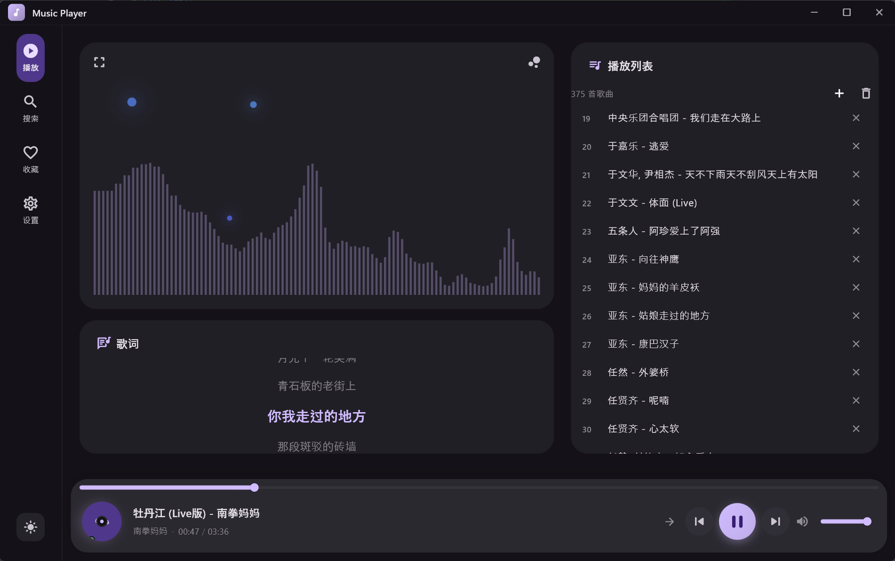

# 🎵 Music Player

<div align="center">


一个功能强大的跨平台桌面音乐播放器，基于 Flutter 框架开发

[功能特性](#-功能特性) • [快速开始](#-快速开始) • [使用说明](#-使用说明) • [开发文档](#-开发文档) • [贡献指南](#-贡献指南)

</div>

---

## 📸 预览

> 精美的 Material Design 3 界面，支持深色/浅色主题

<!-- 添加您的应用截图 -->

<!--  -->
<!--  -->
<!--  -->

## ✨ 功能特性

### 🎧 播放功能
- **本地音乐播放** - 支持 MP3、FLAC、WAV、M4A、OGG 等多种格式
- **在线音乐** - 集成网易云、QQ 音乐、酷狗、酷我等多个音乐源
- **高品质音频** - 使用 SoLoud 引擎，低延迟高质量播放
- **播放控制** - 播放/暂停、上一曲/下一曲、进度跳转、音量调节
- **播放模式** - 顺序播放、列表循环、随机播放、单曲循环

### 📝 歌词系统
- **本地歌词** - 自动识别同名 .lrc 文件
- **在线歌词** - 智能搜索和匹配在线歌词
- **同步显示** - 实时歌词滚动和高亮
- **双语支持** - 支持原文和翻译歌词

### 🎨 界面与主题
- **Material Design 3** - 遵循最新设计规范
- **深色/浅色模式** - 支持主题切换
- **自定义皮肤** - 通过 JSON 配置自定义主题颜色
- **响应式设计** - 适配不同屏幕尺寸

### 📊 音频可视化
- **实时频谱** - FFT 频谱分析显示
- **波形显示** - 音频波形可视化
- **全屏模式** - 支持全屏可视化效果

### ⌨️ 快捷键支持
- **全局快捷键** - 系统级媒体控制
- **Ctrl+Alt+P** - 播放/暂停
- **Alt+左/右** - 快进/快退 5 秒

### ❤️ 收藏与历史
- **收藏管理** - 收藏喜欢的歌曲
- **播放历史** - 自动记录播放历史
- **快速访问** - 快速访问收藏和历史记录

### 📥 下载功能
- **在线下载** - 下载在线音乐到本地
- **多音质选择** - 支持 128k、320k、无损、Hi-Res
- **下载管理** - 查看下载进度和状态

## 🚀 快速开始

### 前置要求

- **Flutter SDK** 3.10.1 或更高版本
- **操作系统**: Windows 10/11、macOS 10.14+、Linux (Ubuntu 20.04+)

### 安装步骤

1. **克隆仓库**

```bash
git clone https://github.com/your-repo/music_player.git
cd music_player
```

2. **安装依赖**

```bash
flutter pub get
```

3. **启用桌面支持**

```bash
# Windows
flutter config --enable-windows-desktop

# macOS
flutter config --enable-macos-desktop

# Linux
flutter config --enable-linux-desktop
```

4. **运行应用**

```bash
# Windows
flutter run -d windows

# macOS
flutter run -d macos

# Linux
flutter run -d linux
```

### 构建 Release 版本

```bash
# Windows
flutter build windows --release

# macOS
flutter build macos --release

# Linux
flutter build linux --release
```

## 📖 使用说明

### 添加本地音乐

1. 点击底部控制区的"添加歌曲"按钮
2. 选择本地音乐文件（支持多选）
3. 点击歌曲开始播放

### 搜索在线音乐

1. 切换到"搜索"标签页
2. 输入歌曲名、歌手名或专辑名
3. 选择音乐源（网易云、QQ 音乐等）
4. 点击搜索结果播放

### 歌词显示

- **本地歌曲**: 将 `.lrc` 文件与音乐文件放在同一目录并同名
- **在线歌曲**: 自动获取在线歌词
- **自动搜索**: 在设置中启用"自动为本地歌曲搜索在线歌词"

### 快捷键

| 快捷键 | 功能 |
|--------|------|
| `Ctrl+Alt+P` | 播放/暂停 |
| `Alt+→` | 快进 5 秒 |
| `Alt+←` | 快退 5 秒 |

## 🏗️ 项目结构

```
music_player/
├── lib/
│   ├── audio/              # 音频相关
│   ├── models/             # 数据模型
│   ├── platform/           # 平台相关（快捷键等）
│   ├── providers/          # 状态管理
│   ├── services/           # 服务层（API 等）
│   ├── ui/                 # 用户界面
│   │   ├── pages/          # 页面
│   │   └── widgets/        # 组件
│   ├── utils/              # 工具类
│   └── main.dart           # 入口文件
├── assets/                 # 资源文件
├── docs/                   # 文档
├── wiki/                   # Wiki 文档
└── test/                   # 测试
```

## 🛠️ 技术栈

### 核心框架
- **Flutter 3.10.1+** - 跨平台 UI 框架
- **Dart SDK** - 编程语言

### 主要依赖
- **flutter_soloud** `^3.4.6` - 高性能音频引擎
- **provider** `^6.1.2` - 状态管理
- **http** `^1.2.2` - HTTP 客户端
- **window_manager** `^0.4.2` - 窗口管理
- **hotkey_manager** `^0.2.3` - 全局快捷键
- **file_picker** `^8.0.0` - 文件选择
- **cached_network_image** `^3.2.3` - 图片缓存

查看完整依赖列表: [pubspec.yaml](./pubspec.yaml)

## 📚 开发文档

详细的开发文档请访问 [Wiki](./wiki/Home.md):

- [项目简介](./wiki/Project-Overview.md) - 了解项目背景和主要功能
- [快速入门](./wiki/Quick-Start.md) - 快速安装和运行指南
- [用户手册](./wiki/User-Guide.md) - 详细的功能使用说明
- [架构设计](./wiki/Architecture.md) - 系统架构和技术选型
- [开发指南](./wiki/Development-Guide.md) - 开发环境配置和开发流程
- [API 文档](./wiki/API-Documentation.md) - 核心 API 和接口说明
- [构建部署](./wiki/Build-Deploy.md) - 跨平台打包和发布

## 🤝 贡献指南

我们欢迎任何形式的贡献！

### 如何贡献

1. Fork 本仓库
2. 创建特性分支 (`git checkout -b feature/AmazingFeature`)
3. 提交更改 (`git commit -m 'Add some AmazingFeature'`)
4. 推送到分支 (`git push origin feature/AmazingFeature`)
5. 开启 Pull Request

### 代码规范

- 遵循 [Effective Dart](https://dart.dev/guides/language/effective-dart) 指南
- 使用 `dart format` 格式化代码
- 运行 `flutter analyze` 检查代码
- 为新功能添加测试

详见 [贡献指南](./wiki/Contributing.md)

## 🧪 测试

```bash
# 运行所有测试
flutter test

# 运行特定测试
flutter test test/lrc_parser_test.dart

# 代码分析
flutter analyze
```

## 📋 待办事项

- [ ] 支持更多音频格式（APE、DSD）
- [ ] 添加均衡器功能
- [ ] 支持播放列表导入/导出
- [ ] 添加迷你模式窗口
- [ ] 支持歌词编辑
- [ ] 支持播客和电台
- [ ] 云同步功能
- [ ] 桌面歌词显示
- [ ] 多语言支持

## 🐛 问题反馈

如果您遇到任何问题或有功能建议，请：

1. 查看 [常见问题](./wiki/User-Guide.md#常见问题)
2. 搜索 [已有 Issues](https://github.com/Daniel2008/music_player/issues)
3. 创建新的 [Issue](https://github.com/Daniel2008/music_player/issues/new)

## 📄 许可证

本项目采用 MIT 许可证 - 详见 [LICENSE](./LICENSE) 文件

## 🙏 致谢

- [Flutter](https://flutter.dev/) - 优秀的跨平台框架
- [SoLoud](https://sol.gfxile.net/soloud/) - 强大的音频引擎
- [GD 音乐台 API](https://music-api.gdstudio.xyz/) - 在线音乐 API 服务
- 所有贡献者和支持者

## 📞 联系方式

- **问题反馈**: [GitHub Issues](https://github.com/Daniel2008/music_player/issues)
- **邮箱**: jinda7632@163.com

---

<div align="center">

**如果这个项目对您有帮助，请给一个 ⭐ Star！**

Made with ❤️ by [Daniel]

</div>
